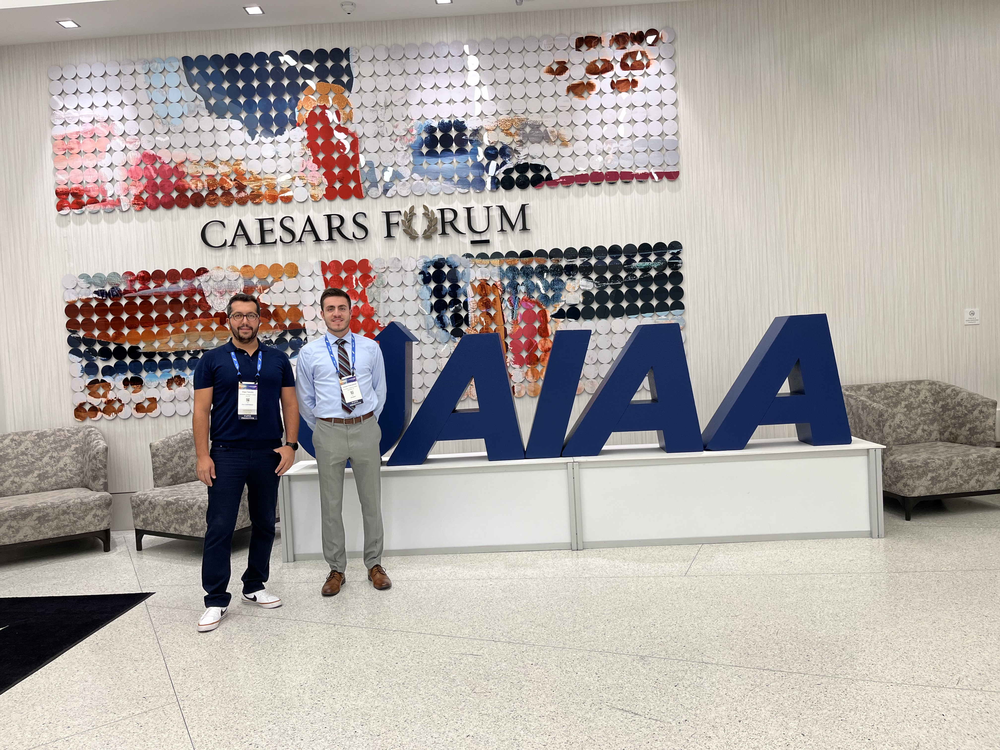
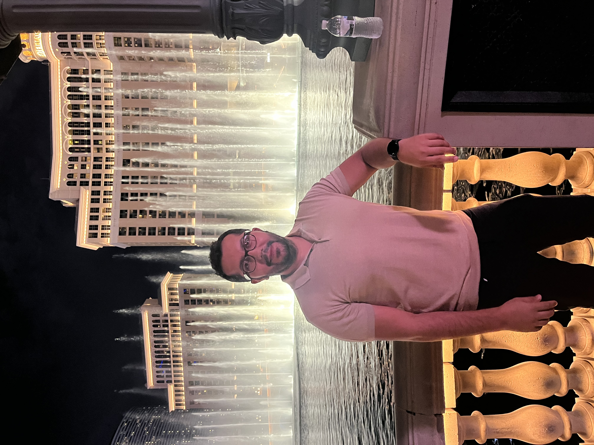
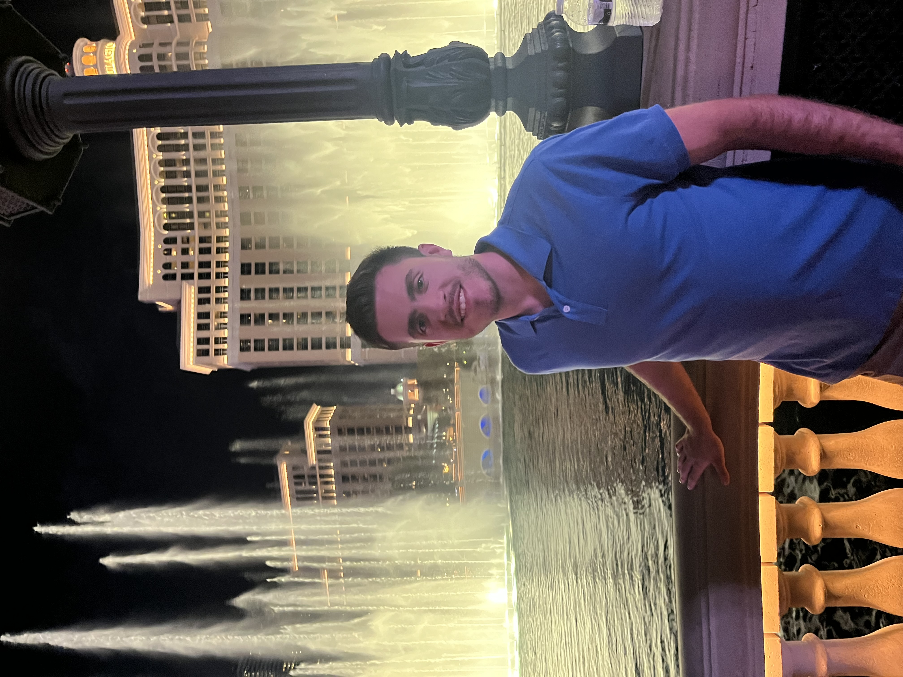
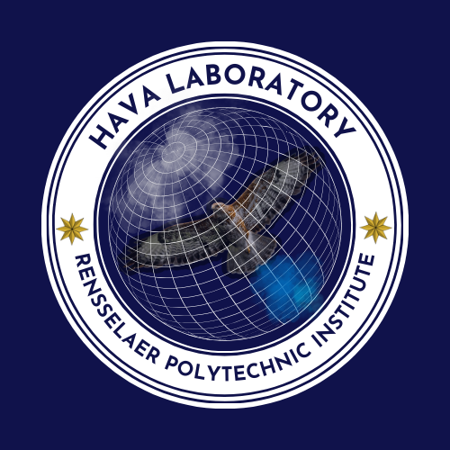

```{=html}
<link href="../html/pages.css" rel="stylesheet">
```

## News:

* Tyler defended his MS thesis titled "Converging-diverging nozzle simulations at varying nozzle pressure ratios" on 03/12/2025. Congratulations, Tyler! 


* Marie joined HAVA Lab. on 01/14/2025. Welcome, Marie! 

* Ozgur and Mateo attended to the AIAA SciTech 2025 Conference on January 6th. 2025. Ozgur presented 
two papers, "Efficient Hypersonic Signature Analysis Through Amortized Inference" and "Assessment of Externally Applied Magnetohydrodynamic Effects
on the Boundary Layer in Shock-Dominated Hypersonic Flows" on 01/09/2025.

* Joy Xiao joined as an undergraduate reseracher to the HAVA Lab on 12/27/2024. Welcome, Joy!

* Nick presented his poster on the topic "Computationally Investigating the Aerodynamic Properties of
Drag-Reducing Aerospikes on Rocket Nose Cones at Hypersonic Speeds"on 12/10/2024 to complete his Master 
of Engineering degree. Congratulations, Nick!

* Jolie Dolan joined the HAVA Lab on 11/25/2025 to pursue her master's of engineering degree. Welcome, Jolie!

* Ozgur presented his work on "Enhancing Pressure Recovery in a Serpentine Duct using Active Flow
Control" at APS DFD 2024 on 11/24/2025 in Utah, NV.

* Ryan Ing has joined the HAVA Lab on 10/31/2024 to pursue his master's degree. Welcome, Ryan!

* Michael Lauver joined the HAVA Lab. Previously, he completed his bachelor's degree at the University of Colorado Boulder. Welcome, Michael!

* Meliksah Koca joined our research laboratory. Before RPI, he completed his post-MS studies at the Von Karman Institute in Belgium. Welcome, Meliksah! He will be working on multiphase and multiscale modeling.

* Ozgur and Joseph attended the Aviation Meeting in Las Vegas on July 28, 2024. Joe presented for the first time. He did very well, and it was a great experience for him.
```{=html}
<head>
    <meta charset="UTF-8">
    <meta name="viewport" content="width=device-width, initial-scale=1.0">
    <title>Three Photos Side by Side</title>
    <style>
        .photo-container {
            display: flex;
            justify-content: space-between;
        }
        .photo-container img {
            width: 50%;
            height: auto;
        }
    </style>
        <style>
        .photo-container1 {
            display: flex;
            justify-content: space-between;
        }
        .photo-container1 img {
            width: 100%;
            height: auto;
        }
    </style>
</head>
<body>
    <div class="photo-container1">
      
    </div>
    <div class="photo-container">
        
        
    </div>
</body>
<div style="height: 50px;"></div> <!-- 50px empty space -->
```
* Mateo Gutierrez has been awarded an NSF ACCESS Explore Computational Award on May 10, 2024 for the project titled "Nonlinear Modal Stability Formulation for Hypersonic Nonequilibrium Flows." Congratulations!

* Mateo Gutierrez has joined the team on April 15, 2024. Welcome, Mateo! He will be working on hypersonic flow modeling with different discretization schemes.

* Our project with Prof. Shankar Narayan on "Modeling Phase-change Kinetics in Nanostructures" has been awarded on March 18, 2023 by NFS Access.

* The HAVA Lab. has been supported by NSF Access compuational resources on the project titled "Advancing High-Fidelity Simulation Techniques for High-Speed Non-equilibrium Flows" Feb. 20, 2023.

* Tyler Martinus has been awarded an NSF ACCESS Explore Computational Award on Feb. 13, 2024 for the project titled "Dynamics of Jet Expansion and Impingement Across a Spectrum of Nozzle Pressure Ratios." Congratulations!

* The HAVA website (version 1) was officially released on January 27, 2024. Tyler's contributions to the name and logo are highly appreciated. Go HAVA!

```{=html}
<div style="height: 30px;"></div> <!-- 20px empty space -->
```
* Johnny Aiello has joined the team on January 20, 2024. Welcome, Johnny! He will be working on multiphase supersonic expansion jets.

* Casey Duncan has joined the team on January 17, 2024. Welcome, Casey! He will be working on porous reactive materials in hypersonic reacting flows.

* Ozgur Tumuklu attended SciTech 2024 (January 8-12, 2024) in Orlando, FL sponsored by RPI MANE. He presented a talk titled "Characterization of Hypersonic Instabilities over a Double Cone."

* Joseph Franciamore joined the HAVA group on November 10, 2023. Welcome, Joe! He will be working on the effect of magnetic fields on hypersonic boundary layers.

* Tyler Martinus has joined the HAVA group. Welcome! Tyler will be working on the expansion characteristics of jets at different ambient pressures.

* Ozgur Tumuklu's paper was highlighted as an editor's pick in Physics of Fluids, 
 <a href="https://doi.org/10.1063/5.0169648"> here. </a>

* On August 16, 2023, Dr. Tumuklu joined RPI's MANE department.


