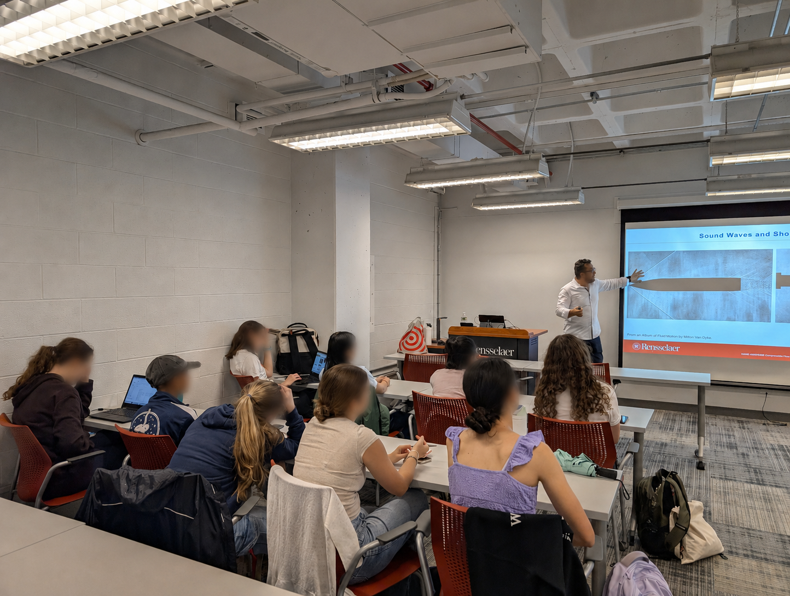
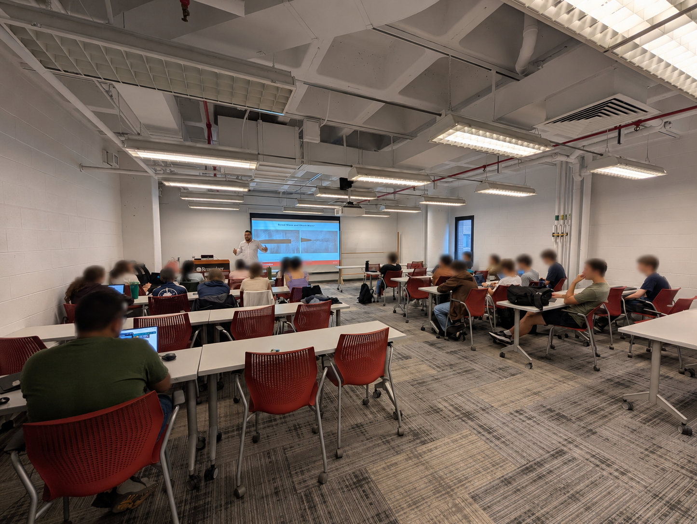

```{=html}
<link href="../html/pages.css" rel="stylesheet">
```

## Summer Program
The PREFACE Summer Program at RPI provides high school students with an opportunity to learn about STEM and engineering fields. Each summer, I volunteer in the program and teach high school students about aerospace engineering and the science behind flight. The program gives students an opportunity to learn basic engineering concepts, ask questions, and gain hands-on experience with aerospace engineering.


{fig-alt="An instructor leads a Summer Program lesson for high school students."}

{fig-alt="Summer Program participants gathered together."}
