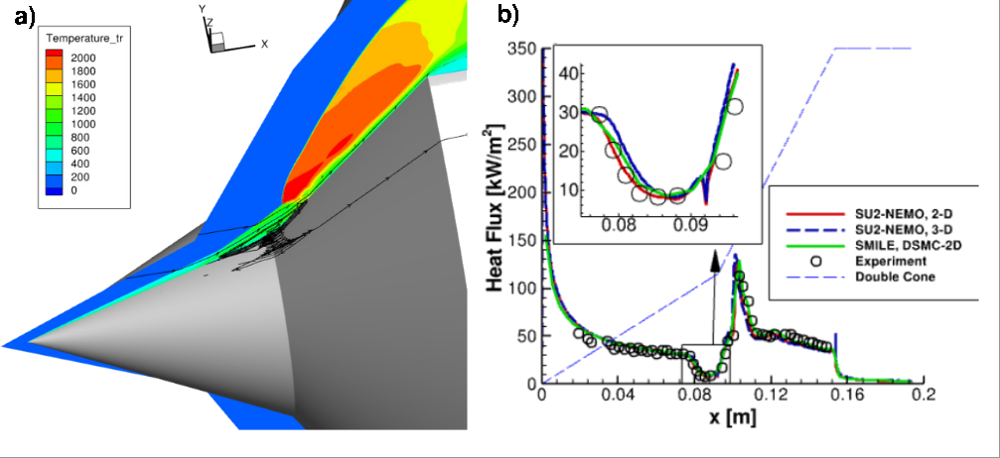
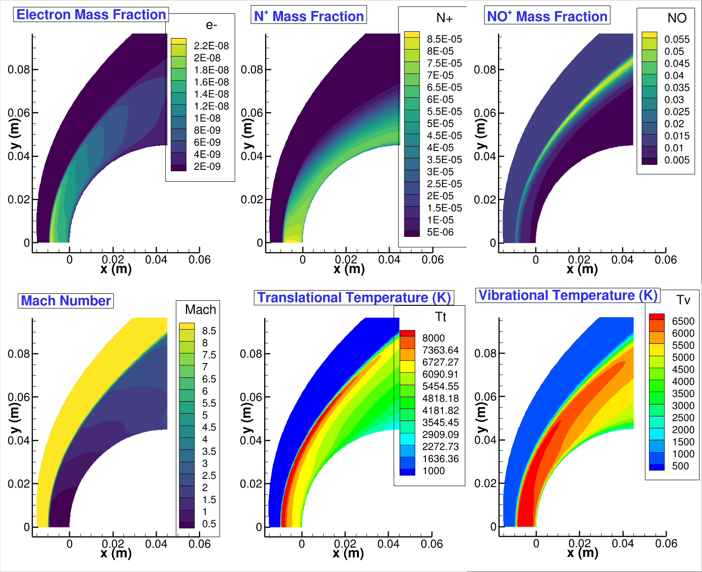
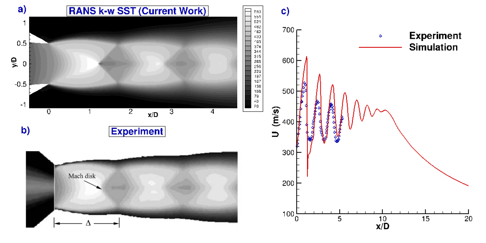
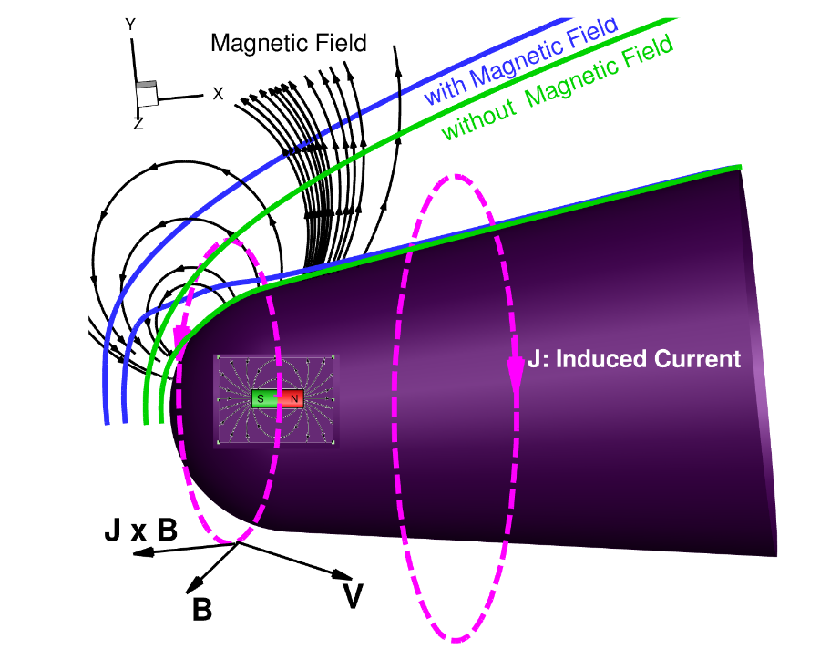
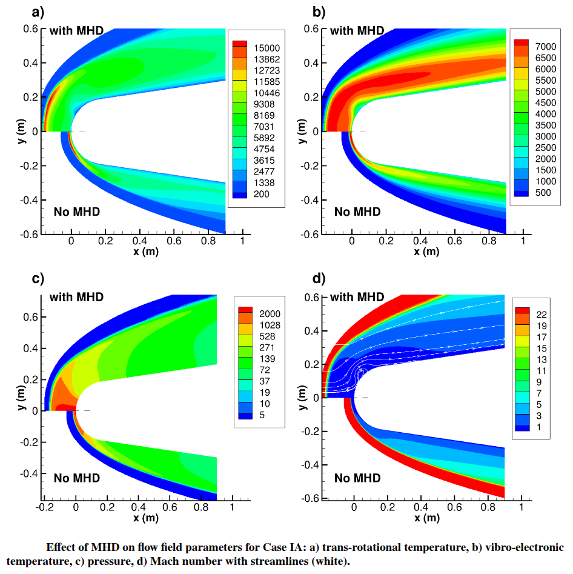
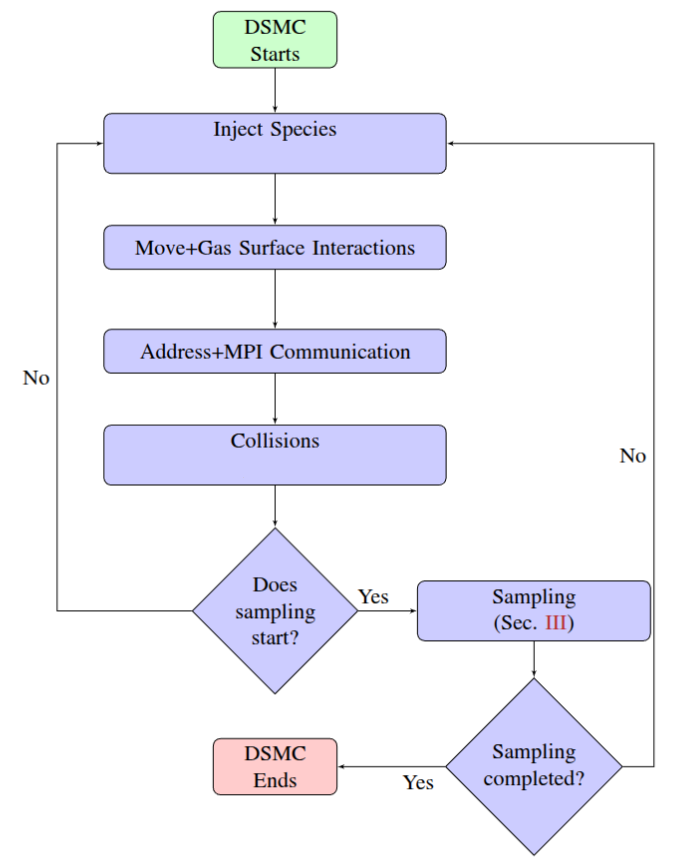
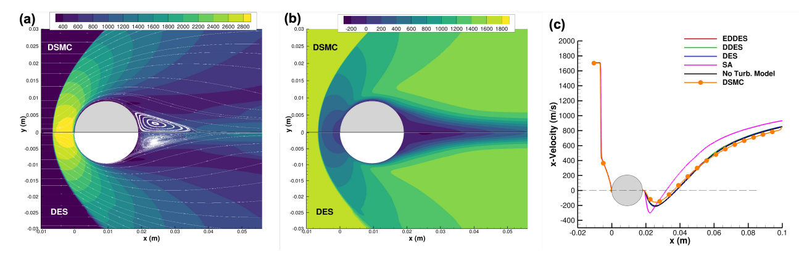

Our team conducts research on a wide spectrum of flow modeling, including rarefied flows, turbulence modeling, magnetohydrodynamics, multiphase and hypersonic flow modeling, among others.
```{=html}
<link href="../html/pages.css" rel="stylesheet">

```

<script src="https://cdnjs.cloudflare.com/ajax/libs/mathjax/3.2.0/es5/tex-mml-chtml.min.js"
 integrity="sha384-R3KGKk8jJA2o5U6d3k1z9DkSw/pzbKz7bVFNMT+M5l6d5itoM3DkEJBn59HA3xS7" crossorigin="anonymous">
 </script>

<script>
  MathJax = {
    tex: {
      inlineMath: [['$', '$'], ['\\(', '\\)']]
    },
    svg: {
      fontCache: 'global'
    }
  };
</script>

## In a nutshell:
<iframe src="VPR_Poster.pdf" style="width: 800px;height: 1100px;border: none;"></iframe> 


## Hypersonic Flow Modeling

Hypersonic shock wave boundary layer interactions (SWBLI) are a crucial aspect of aerospace engineering,
 particularly in the design and analysis of high-speed vehicles such as reentry spacecraft and missiles. 
 These interactions occur when a shock wave, generated by the vehicle traveling at hypersonic speeds,
 impinges on the boundary layer that develops along the vehicle’s surface.
 This interaction can lead to complex flow phenomena including boundary layer separation, increased
 heat transfer, and heightened skin friction, which can significantly affect vehicle stability and thermal loading. 
 Accurate modeling of SWBLI is essential for predicting these effects and ensuring the structural integrity and performance
 of hypersonic vehicles. Computational Fluid Dynamics (CFD) simulations, supported by wind tunnel experiments and advanced
 turbulence models, play a pivotal role in understanding and mitigating adverse SWBLI effects, enabling safer and
 more efficient vehicle designs.

```{=html}
          <div style="position: relative; padding-bottom: 50%; height: 0; overflow: hidden;">
            <iframe src="DoubleWedge3D_780Pa_Mach7.mp4" 
                    style="position: absolute; top: 0; left: 0; width: 100%; height: 100%;" 
                    frameborder="0" allowfullscreen allow="autoplay; encrypted-media"></iframe>
          </div>

```
Spatial variation of the span wise velocities (m/s) at (a) x=0.025~m, (b) x=0.04~m,
 (c) x=0.05~m, and (d) x=0.064~m constant planes along with (e) the surface heating values (W/m$^2$) 
 and surface streamlines superimposed with the density gradient magnitude for $Re$ = 374,000(1/m). 


The spatial distribution of the spanwise velocity, 𝑊 (m/s), at three different x-constant planes: (a) x =
0.04 m, (b) x = 0.064 m, and (c) x = 0.08 m along with (d) the numerical Schlieren in grayscale and the surface
heat flux values along with the wedge surface (W/m^2 ) for the unit 𝑅𝑒 = 4.14 × 105 1/𝑚  (i.e., 𝑃∞ = 781 Pa) flow
over the 5/30◦ double-wedge configuration.


Comparisons of the surface parameters for the unit $Re =9.35 \times 10^4~m^{-1}$ a) 
Spatial distribution of the translational temperatures, b)  surface heating values (kW/m$^2$)
 for the continuum SU2-NEMO 2-D and 3-D solutions for the lowest pressure case,  $Re = 9.35 \times 10^4~m^{-1}$.


```{=html}
          <div style="position: relative; padding-bottom: 50%; height: 0; overflow: hidden;">
            <iframe src="3D_3055.mp4" 
                    style="position: absolute; top: 0; left: 0; width: 100%; height: 100%;" 
                    frameborder="0" allowfullscreen allow="autoplay; encrypted-media"></iframe>
          </div>

```


### HAVA-HYPERFDX1

HAVA-HYPERFDX1 is an in-house high-fidelity GPU-accelerated solver framework developed by the HAVA Laboratory
for hypersonic flow simulations involving strong shocks, separated regions, and high-temperature gas effects.
The solver is designed to support detailed studies of canonical and vehicle-relevant configurations, including
shock wave boundary layer interactions and compression-corner flows, where accurate resolution of gradients,
surface loading, and unsteady structures is essential. The animation below illustrates a representative
HAVA-HYPERFDX1 calculation, highlighting the ability of the solver to capture complex shock structures and
their interaction with the surrounding flow field. This wake simulation was carried out using approximately 
0.3 Billion grid points on my $3K desktop in less than 15 hours — not on large HPC clusters with thousands of nodes.

<video style="height: 100%; width: 100%;" controls autoplay loop muted playsinline>
  <source src="FDX1.mp4" type="video/mp4">
</video>


```{=html}
          <div style="position: relative; padding-bottom: 50%; height: 0; overflow: hidden;">
            <iframe src="DC.mp4" 
                    style="position: absolute; top: 0; left: 0; width: 100%; height: 112%;" 
                    frameborder="0" allowfullscreen allow="autoplay; encrypted-media"></iframe>
          </div>

```

## Chemically Reacting Flows

Chemically reacting flow in hypersonic environments involves examining how high-speed airflow influences
 and modifies chemical reactions within a fluid. At hypersonic velocities—commonly exceeding five times
the speed of sound—the intense compression and friction heat the surrounding air, causing dramatic
temperature increases. This severe heating prompts molecular dissociation and diverse chemical reactions in the air.
Such understanding is essential for engineering materials and propulsion systems robust enough to endure the rigorous
conditions of hypersonic flight. These investigations are crucial for predicting heat transfer rates, assessing material
degradation, and evaluating the performance of hypersonic vehicles, thereby driving advances in aerospace technologies
designed for extreme speeds. Our team focuses on integrating high-fidelity chemistry data into our
inhouse/open-source solver to accurately benchmark the effects of real gases.


## Supersonic Jet Expansion Flows
Supersonic free and impinging jets play an important role in different practical applications,
such as vertical short takeoff and landing, jet blast deflectors, turbine blade cooling,
lunar landing modules, space launch vehicle systems, electronics cooling, and cold spray coating.
The complex nature of these supersonic jets originates the simultaneous presence of
multiple shocks, expansion waves, and their interactions with large-scale vortical structures
in shear layers. The flow characteristics of underexpanded impinging jets are primarily
influenced by the nozzle pressure ratio (NPR), defined as the ratio of stagnation pressure
 to ambient pressure (𝑃∞), the nozzle temperature ratio (NTR), the ratio of stagnation temperature
to ambient temperature (𝑇∞), the nozzle-to-wall distance (ℎ), and the jet Mach number (𝑀𝑎).
The HAVA Lab carries out subsonic and supersonic jet simulations to analyze the expansion behavior
of turbulentjets under varying NPRs and NTRs.

```{=html}
          <div style="position: relative; padding-bottom: 50%; height: 0; overflow: hidden;">
            <iframe src="JetWebsite2.mp4" 
                    style="position: absolute; top: 0; left: 0; width: 100%; height: 100%;" 
                    frameborder="0" allowfullscreen allow="autoplay; encrypted-media"></iframe>
          </div>

```
```{=html}
          <div style="position: relative; padding-bottom: 50%; height: 0; overflow: hidden;">
            <iframe src="JetWebsite3.mp4" 
                    style="position: absolute; top: 0; left: 0; width: 100%; height: 100%;" 
                    frameborder="0" allowfullscreen allow="autoplay; encrypted-media"></iframe>
          </div>

``` 
Spatial variation of the (a) density gradient  (kg/m$^4$)  (b) temperature (K), (c) Mach number, and (d) turbulence kinetic energy ($m^2/s^2$) for the impinging case h/D. 


Comparison of the velocity profiles for the free expansion jet with a NPR of 4.03: a) the spatial distribution of the velocity magnitude (m/s) for the current work vs. b) the experiment (Henderson (2005)), and c) the streamwise component at the centerline.


## MHD Control 
Methods of leveraging magnetic fields produced by hypersonic vehicles to reduce drag forces experienced
 during reentry are currently being investigated by the HAVA Lab. Through an extensive
campaign of computationally demanding simulations, ideal locations of magnetic fields have been determined using a
design-driven approach, to optimize a product that can readily be adopted by companies and organizations
in the field. This method of drag reduction relies specifically on modifying viscous action at the surface,
which is the primary mode of aerodynamic force applied to streamlined bodies at a small angle of attack. 
Similar technology is also hoped to be applied to larger-scale spacecraft, including spacecraft such as SpaceX's
 Starship with the goal of reducing aerodynamic heating at control surfaces.




## Flow Control 
Our team has been working with <a href="https://cefpac.rpi.edu/"  style="color: white;"> the Center for Flow Physics and Control (CeFPaC)</a><br/> on flow control using numerical approaches. 
The aim is to validate our numerical tools with the in-house experiments conducted by Prof. Miki Amitay's group and to predict the flow field where experiments are expensive to carry out.
The ultimate aim is to apply this technology to hypersonic flows, where the duration of the experiments is very short.
```{=html}
          <div style="position: relative; padding-bottom: 70%; height: 0; overflow: hidden;">
            <iframe src="movieMiki2.mp4" 
                    style="position: absolute; top: 0; left: 0; width: 100%; height: 100%;" 
                    frameborder="0" allowfullscreen allow="autoplay; encrypted-media"></iframe>
          </div>
```
Subsonic turbulent flow in a diffuser using LES modeling.

## DSMC Method To Model the Boltzmann Equation
<p>Direct simulation Monte Carlo (DSMC) [Bird] is a kinetic approach that
 provides 
a numerical approximation to the solution of the Boltzmann equation of transport
 given as</p>

$$\frac{\partial}{\partial t}(nf(c_i))+c_j\frac{\partial}{\partial x_j}(nf(c_i)) +
 \frac{\partial}{\partial c_j}(F_j~nf(c_i))=\frac{\partial (nf(c_i))}{\partial t}$$
where $f(c_i)$ and $n$ are the distribution function of class $c_i$ and number density, respectively.
The external force field acting on gas molecules, $F_i$, is generally assumed to be zero for gas flows.
The underlying mechanism behind  the DSMC method is to decouple collisions and particle motion by ensuring
that the time step is smaller than the mean collision time and particles do not cross multiple cells in each time step.
<p>As shown in Figure, to solve the Boltzmann transport equation in a stochastic manner, particle states
 are initialized first. After introducing computational particles at inflow boundaries, the proceeding steps
 are as follows: (2) move the particles, (3) perform collisions stochastically within collision cells, and lastly
 (4) sample particle quantities to evaluate macroscopic properties. Newtonian mechanics is employed to perform the
 movement and gas-surface interactions of computational particles in DSMC and to apply boundary conditions. Therefore,
 details will be presented in the next versions of this document. Modeling of collisions is crucial since they determine
 the transport properties for thermal conductivity, diffusion, and viscosity. 
 DSMC is a very efficient and robust approach especially for high-Knudsen number flows. .</p>



## Rarefied Flow Modeling

Our group carry out both kinetic and continuum simulations using the open-source and
inhouse software to investigate the turbulent nature of rarefied hypersonic wakes for wide spectra of flows.
Specifically, in this test case, we focused on hypersonic flows over a cylinder to examine
the unsteady characteristics of rarefied and continuum turbulent wake flows. 
SPARTA, an open-source DSMC solver, was employed to capture the large gradients associated with 
shock-expansion wave interactions, particularly in the wake region. On the other hand, continuum 
simulations were performed using SU2-NEMO, an open-source non-equilibrium solver, for flows with a 
relatively low freestream pressure of up to 100 Pa, which are characteristic of rarefied conditions.
As shown in Figure (below), the translational temperatures predicted by the Navier-Stokes (NS) equations with 
the detached Eddy Simulation (DES)  turbulence model, as well as the direct simulation Montel Carlo (DSMC) 
results, exhibit excellent agreement, with streamlines in white illustrating the flow. Similarly, the axial 
velocity profiles of the DSMC closely match those of the NS. For a more detailed comparison, the axial velocities 
obtained from NS using different turbulence models, including the Spalart-Allmaras (SA) model and the hybrid LES-RANS 
model (DES and Detached DES, DDES), are compared in Figure. along the stagnation line. 
The agreement between NS and DSMC is particularly strong in the recirculation region, where the axial 
velocity drops below zero. It is important to note that, as discussed earlier, turbulence fluctuations 
in these simulations are not strong enough to significantly affect the mean flow properties, resulting in 
nearly perfect agreement between the NS solution without a turbulence model and the DSMC results. However, 
benchmarking various turbulence models against DSMC at relatively low Reynolds numbers provides valuable 
insights into the origins of macroscopic fluctuations and the accuracy of these models in low-density hypersonic flows. 
The discrepancy observed between the SA model and DSMC is not unexpected, given the limitations of the SA model in
predicting high-speed separated flows. Further details are presented in 
```{=html}
            <div class="btn-box">
                <a href="https://web.archive.org/web/20240210143104id_/https://watermark.silverchair.com/080013_1_5.0187575.pdf?token=AQECAHi208BE49Ooan9kkhW_Ercy7Dm3ZL_9Cf3qfKAc485ysgAABYkwggWFBgkqhkiG9w0BBwagggV2MIIFcgIBADCCBWsGCSqGSIb3DQEHATAeBglghkgBZQMEAS4wEQQMF5i4qg8bAse1Jr4nAgEQgIIFPEDKvV5dRhbN_emF1hFUniSOeSBNH2_M3B-cWP6R8RcqHHe0E4hM6-yCvm1pPxiiiVO2CNbhEecUHcVxyjDfrboOXp1wDhFCIw5yCajfc7KLXyN_ZIiR4-azwdwlop4M_j7fVYaeT3V_3UVf0lbwquhKEY0u1RbP62Pk3u_0W6fTpI-sZipc31LaxQzvSQylqtfL_OHDeI00MQFMPybzpXc7QT1YMR65ow35R6nKqnhI-so6RUJQT-ROqOApjiXIjYlGOhGxu3NfgttEqnQpryA9_a0pAuQ4HvtOK0y4lzoRlv-BKtWZe2bWV2Ydl6gmAwbhpI9W8jrEItkkKzxKoqT20t00TorbyWMVRORWEhX1hfHFnbdyNBHjwPjw61fMXEODhwdU05rcFWOSKLIv7xck-z6DE-RdZnA-4A05jzPp7rIYVfQ3tNfG5DakF9T6e_aKZVak30bAirquCvR09MPrD94djapadQikNhzoomeeXxMAdtp2INDQD7BEH_aBbiugWjD53ON29CtB73KuABzLTh-PWqJf1wr6Ug-etnWpEMpcKRIFhUwnxRnzBjJ_OEAYSV13iSsLspA7jkcqLT7-Ua2XKHBM5uXg9PUt_TX8v0gmrKhQXdHxuZlIk58Nq0AueRNRQT1yNpkb1Fo45vbLA65fV2E3TaeQECzQGg5YV91uF1i2-Hp3F9UzAv1wpL8tZImDYFlGGXY1yVZYG7jtXP4NFSIlOo4_Pe0ll4wJomU9lBZCfXhu3rLun56dxWMCejooXeU1nGOWwyqQTL_rDGhfyWH8A5N3QoKznr-Zy6iQo_eHYpHYqt7A-o6LRG95KqZpqNWeGuUl2pX9tl3qVGfGO0MRusB0bPuzrAcUygHv5Fb5Ww62w8xr869lbC-slNLfv9R0KJm0RmPgyEgxCdARTPOXSxv9PXgPkEbIP63JxJljoZzkl_JExpvNeRYOtC1h7r2GXRI1SdTk0U0il9AWm-yw0NKGMtuc9ejdhy-k2sVw41FYJFzWfpN2jULDwjNdp0xRJnSIEdDBGLvnvSsn0URNkJ6hWemr6TZjTIpffUK-qo9ydoP_3R_lMUfh7i0Ndy4jnM78mJAg16Z27lyVVr35KYSo7uuHS4ZQ6hfYBh0xfeg_8-DhoEW1hgV-jiwXh38r9WVHa-FbAPBJSUitTZYUr6QP0J92Zah6jUfX7xLa69EBilDNXKUVMYxBRl8jk9AQUAf2l7GCD0d6lJ_LR_jErt99Ak9gbhZ_sYwK5iuX-B8HY3IuUL1hveDgI3B8Ii_OgCKHE7YC8ca8h4Zhi-4BKS-notq6v8yWDENPxIhLYcFs2t53Zb3tGwDbLn90LQNNE-rWsMBh0u4OJ9DePsggNMjuFCxpj9OAsTLhTrdRSX4Spb4f10Clfy3-1U8G4XhMzbBAp2nCdr6I5fu4Ta_G_viijVcaAgbFD_d8yJ8zACF6lrxdFXvCm0a5Pywi46JuoLAy33gg7hDiaCQ8XKsxtAwJDlt05ui2aOYqQvG4EB6_1sF1Nd1ieWYG2KuB9y3zq_Any_wt1meH6flNg6Pjg1OvulqwtbDRrDTI0frBXEP7XVCzl7F3Zv_3A9cBiNY5DxGHjmqTCFm_dVvwa4udVvaCfvVdrUlSGrVLfL8BvXelZztmo5zFGJcY4h0feptYZRsf0HEOE5t8hUzEiCwWBMXkDbz83ZCSsp6-49xr7Xic6kscWEOmwDZwm0D_5PPdPBuKdz06BZOR_31F7Wsau3OvthWDtt6aXcxqzPjSqXjK5bie"> Paper </a>
            </div>
```



Comparison of DSMC (SPARTA) and NS solutions for argon at the freestream pressures of 100~Pa at $Ma$ 7 for (a) temperature field (K), (b) the axial velocity (m/s), and (c) axial velocity along the stagnation line with various Navier-Stokes turbulence models using SU2.
