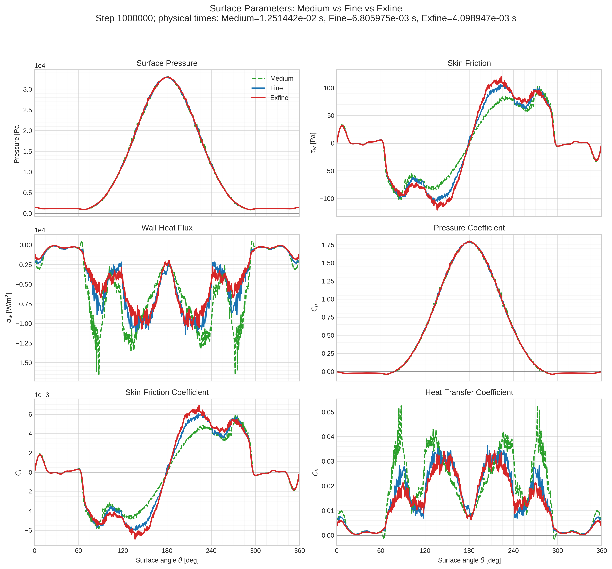
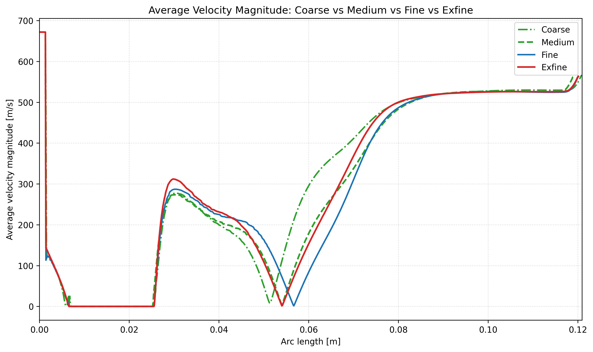
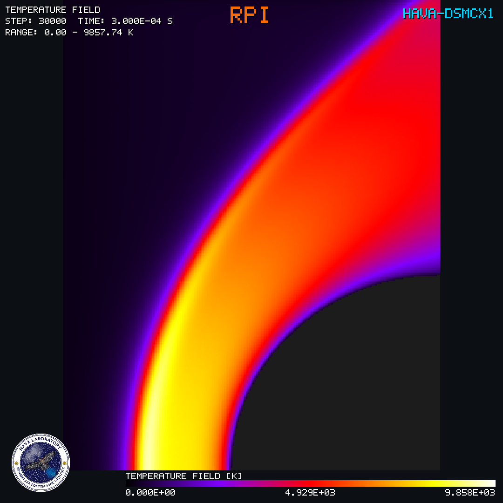
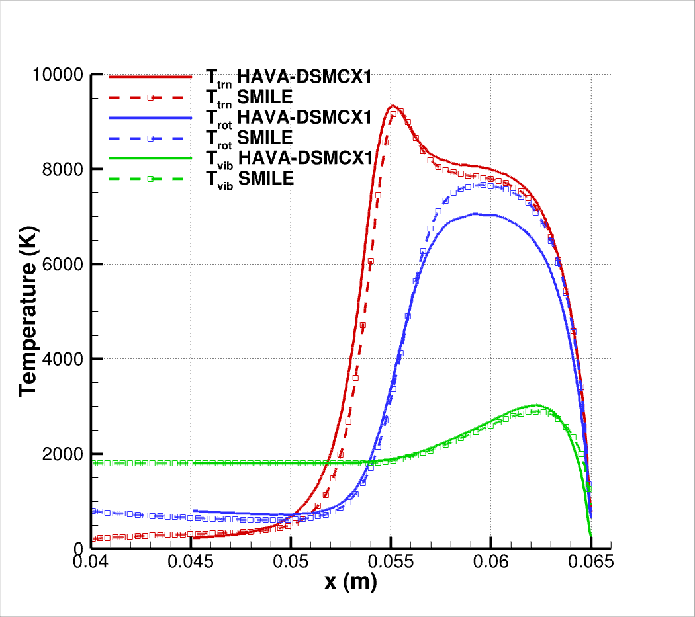
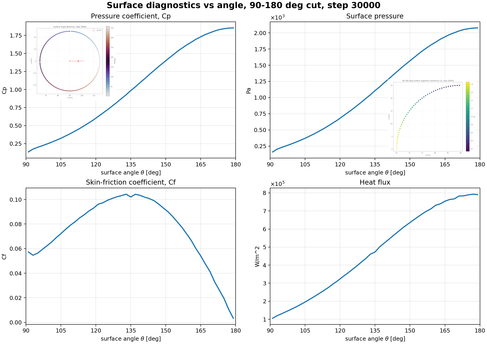
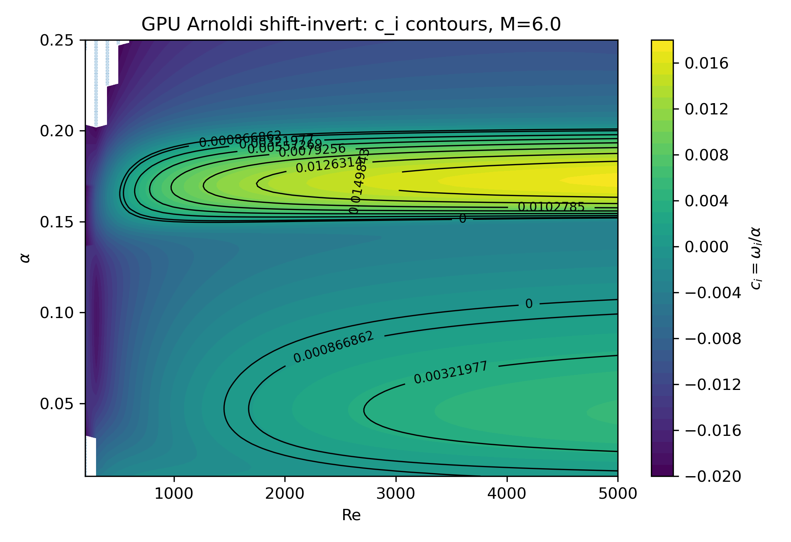
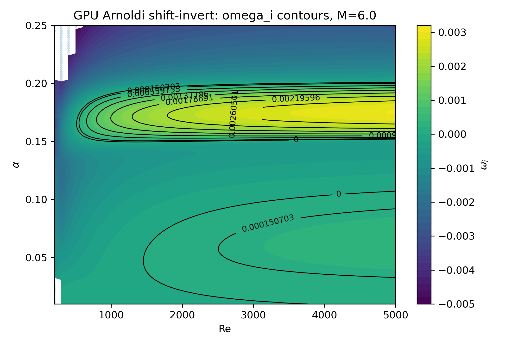
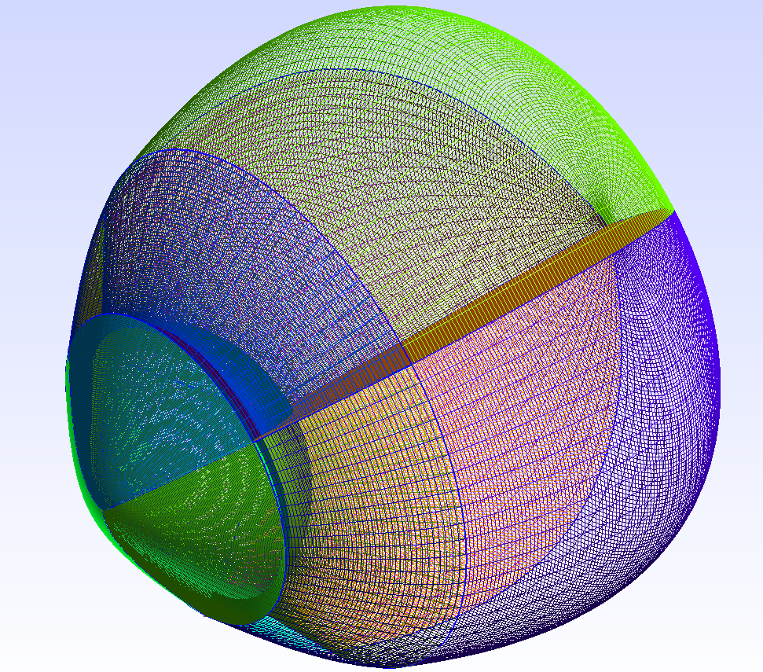
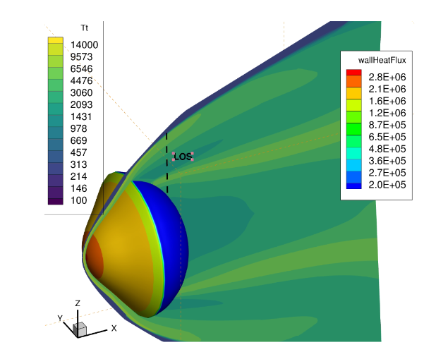
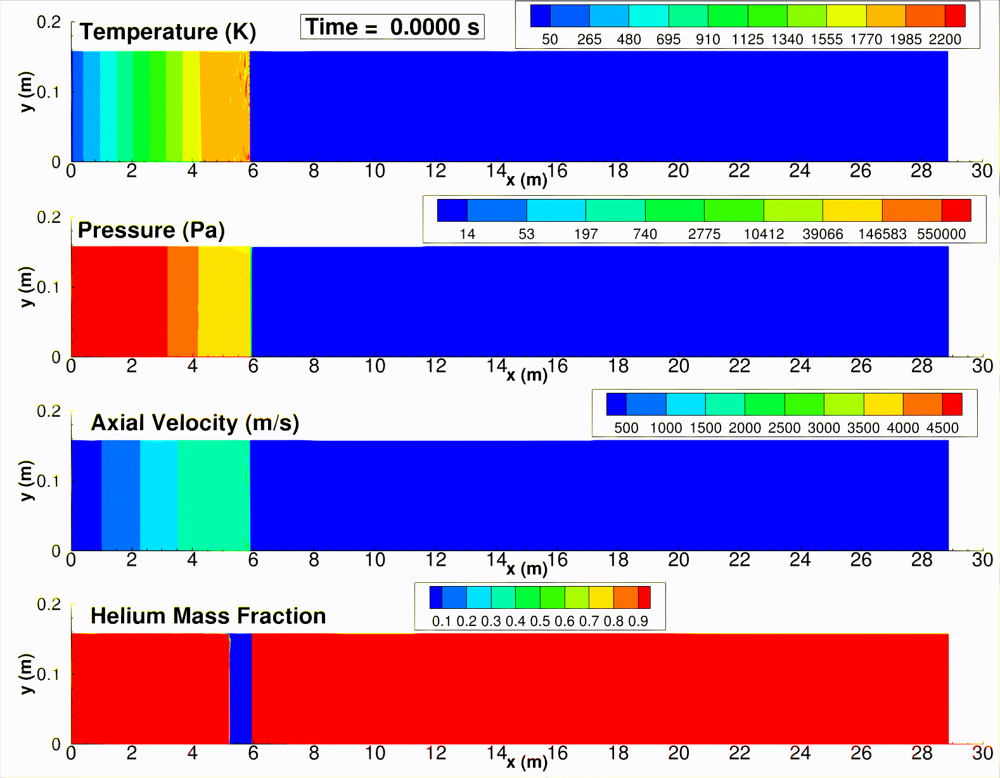

```{=html}
<link href="../html/pages.css" rel="stylesheet">
<style>
  .software-tabs .nav-tabs {
    border-bottom: 0;
    gap: 0.75rem;
  }

  .software-tabs .nav-tabs .nav-link {
    align-items: center;
    background: #00abf0;
    border: 2px solid #00abf0;
    border-radius: 8px;
    color: #081b29;
    display: inline-flex;
    font-size: 1rem;
    font-weight: 600;
    justify-content: center;
    letter-spacing: 1px;
    min-height: 2.4rem;
    min-width: 12rem;
    padding: 0.35rem 1rem;
    position: relative;
    text-decoration: none;
    transition: 0.5s;
  }

  .software-tabs .nav-tabs .nav-link:hover,
  .software-tabs .nav-tabs .nav-link.active {
    background: #081b29;
    color: #00abf0;
  }

  .software-tabs .tab-content {
    padding-top: 1.25rem;
  }

  .software-media {
    display: block;
    height: auto;
    margin-top: 1rem;
    max-width: 100%;
  }

  .software-figure-row {
    display: grid;
    gap: 1rem;
    grid-template-columns: repeat(2, minmax(0, 1fr));
    margin-top: 1rem;
  }

  .software-figure-row img {
    aspect-ratio: 1 / 1;
    background: #fff;
    display: block;
    height: 100%;
    object-fit: contain;
    width: 100%;
  }

  .software-video-frame:fullscreen,
  .software-video-frame:-webkit-full-screen {
    align-items: center;
    background: #000;
    display: flex;
    height: 100vh !important;
    justify-content: center;
    max-height: 100vh !important;
    max-width: 100vw !important;
    padding: 0 !important;
    width: 100vw !important;
  }

  .software-video-frame:fullscreen .software-media,
  .software-video-frame:-webkit-full-screen .software-media,
  .software-media:fullscreen,
  .software-media:-webkit-full-screen {
    height: 100vh !important;
    margin: 0 !important;
    max-height: 100vh !important;
    max-width: 100vw !important;
    object-fit: contain !important;
    width: 100vw !important;
  }

  .software-fullscreen {
    background: #00abf0;
    border: 2px solid #00abf0;
    border-radius: 8px;
    color: #081b29;
    cursor: pointer;
    display: inline-flex;
    font-weight: 600;
    margin-top: 0.75rem;
    padding: 0.35rem 0.9rem;
    transition: 0.5s;
  }

  .software-fullscreen:hover {
    background: #081b29;
    color: #00abf0;
  }

  .software-fullscreen-hint {
    color: #ededed;
    display: inline-block;
    font-size: 0.9rem;
    margin-left: 0.75rem;
    margin-bottom: 1rem;
  }
</style>
```

::: {.software-tabs}

::: {.panel-tabset}

## HAVA-HYPERFDX1
**HYPERFDX1** is an in-house **GPU-accelerated** solver for hypersonic reacting flows developed by the PI. The code employs high-order numerical schemes to resolve complex flow physics with high fidelity in a fully time-accurate framework. Designed specifically for large-scale simulations of extreme-flow environments, HYPERFDX1 leverages modern GPU architectures to achieve substantial computational efficiency while maintaining excellent numerical accuracy.

The solver incorporates on-the-fly rendering and rasterization capabilities, enabling interactive visualization of massive datasets during runtime without the need for computationally intensive post-processing. On a single GPU, HYPERFDX1 achieves speedups of approximately **30x** relative to conventional CPU-based CFD solvers executed on multiple compute nodes, while maintaining the ability to simulate, process, and visualize flow fields containing hundreds of millions of grid points. This capability enables rapid analysis of large-scale hypersonic simulations and significantly shortens the time from computation to scientific insight.

The movies shown below correspond to low- and high-Reynolds-number hypersonic flow simulations performed on meshes containing approximately **300 million grid points**. The simulations took less than **15 hours** on local PC equipped with a RTX-4090. Ongoing developments include the integration of gas--gas and gas--surface reaction models, as well as thermochemical nonequilibrium chemistry capabilities relevant to hypersonic flight and atmospheric entry applications. Extensive verification and validation studies are currently underway to establish the solver's accuracy, robustness, and predictive capability across a wide range of flow conditions.

**High-Reynolds-number Flow over a Cylinder:**

```{=html}
<div id="hyperfdx1-video-frame" class="software-video-frame">
  <video id="hyperfdx1-video" class="software-media" controls autoplay loop muted playsinline>
    <source src="../projects/FDX1.mp4" type="video/mp4">
  </video>
</div>
<button class="software-fullscreen" type="button" data-fullscreen-target="hyperfdx1-video">Full screen</button>
<span class="software-fullscreen-hint">Hit the <strong>ESC</strong> key to exit full-screen mode.</span>
<script>
  document.addEventListener("click", (event) => {
    const button = event.target.closest("[data-fullscreen-target]");
    if (!button) return;

    const target = document.getElementById(button.dataset.fullscreenTarget);
    if (target?.requestFullscreen) {
      target.requestFullscreen();
    } else if (target?.webkitRequestFullscreen) {
      target.webkitRequestFullscreen();
    }
  });
</script>
```
<br/>

**Low-Reynolds-number Flow over a Cylinder:**

Supersonic flow over a cylinder at Mach 4 was experimentally investigated by Prof. Shepherd's group at Caltech. We validated **HAVA-HYPERFDX1** against the same test case. This configuration is particularly challenging because the wake exhibits characteristics associated with the onset of transition to turbulence. The solver successfully reproduced the dominant wake frequencies and corresponding Strouhal numbers, demonstrating its ability to capture the underlying unsteady flow physics. In addition, the predicted surface quantities showed consistent behavior and excellent agreement with results obtained using our in-house OpenFOAM-based solver, which is approximately 30 times slower than HAVA-HYPERFDX1.

Current development efforts are focused on incorporating real-gas effects, advanced thermochemical nonequilibrium models, and high-fidelity wall treatments for Large-Eddy Simulation (LES) to further enhance predictive accuracy for high-speed and hypersonic flow applications.


```{=html}
<div id="hyperfdx1-video-frame" class="software-video-frame">
  <video id="hyperfdx1lowRe-video" class="software-media" controls autoplay loop muted playsinline>
    <source src="../projects/LowRe_Cylinder.mp4" type="video/mp4">
  </video>
</div>
<button class="software-fullscreen" type="button" data-fullscreen-target="hyperfdx1lowRe-video">Full screen</button>
<span class="software-fullscreen-hint">Hit the <strong>ESC</strong> key to exit full-screen mode.</span>
<script>
  document.addEventListener("click", (event) => {
    const button = event.target.closest("[data-fullscreen-target]");
    if (!button) return;

    const target = document.getElementById(button.dataset.fullscreenTarget);
    if (target?.requestFullscreen) {
      target.requestFullscreen();
    } else if (target?.webkitRequestFullscreen) {
      target.webkitRequestFullscreen();
    }
  });
</script>
```
<br/>






## HAVA-DSMCX1

**HAVA-DSMCX1** is an in-house, GPU-accelerated direct simulation Monte Carlo (DSMC) solver developed by PI for the simulation of rarefied gas dynamics and non-equilibrium flows. DSMC is widely regarded as a commonly used numerical approach for solving the Boltzmann Transport Equation (BTE) in regimes where continuum assumptions break down, including hypersonic flows, spacecraft plumes, high-altitude aerothermodynamics, vacuum expansions, and plume–surface interactions.

HAVA-DSMCX1 is designed to exploit modern **GPU** architectures, enabling large-scale simulations that would otherwise require substantial computational resources on conventional CPU-based platforms. The solver employs highly optimized particle-movement, collision, and sampling algorithms to maximize throughput while maintaining DSMC accuracy. As a result, HAVA-DSMCX1 can achieve speedups exceeding **50–100x** compared with traditional CPU-based DSMC implementations, depending on the problem configuration and hardware.

The software supports both steady and time-accurate simulations of three-dimensional flows involving complex geometries, moving boundaries, gas-surface interactions, and multi-species gas mixtures with thermal nonequilibrium. Advanced particle-weighting and adaptive sampling techniques enable efficient simulations spanning a wide range of Knudsen numbers, from continuum to free-molecular flow regimes.

To facilitate the analysis of large-scale simulations, HAVA-DSMCX1 incorporates GPU-based rendering and rasterization capabilities that allow flow-field quantities to be visualized during runtime. This eliminates expensive post-processing workflows and enables interactive exploration of simulations containing hundreds of millions of computational particles.

The solver serves as the kinetic component of the HAVA multi-fidelity framework and is being integrated with GPU-accelerated Navier–Stokes and hybrid continuum–kinetic solvers. Ongoing developments include gas-phase chemistry, gas-surface reactions, particle-laden flows, plasma and electromagnetic effects, and machine-learning-assisted acceleration strategies for next-generation hypersonic and space applications.

The simulation shown below demonstrates the capability of HAVA-DSMCX1 to efficiently resolve complex moving rarefied-flow structures at Mach 12 while maintaining high physical fidelity and excellent computational performance on modern GPU hardware. The simulation is performed on a desktop workstation equipped with an NVIDIA RTX 4090 GPU, highlighting the solver's ability to capture detailed flow physics at a fraction of the computational cost of conventional DSMC implementations.
```{=html}
<div id="dsmcx1-video-frame" class="software-video-frame">
  <video id="dsmcx1-video" class="software-media" controls autoplay loop muted playsinline>
    <source src="../projects/DSMCX1.mp4" type="video/mp4">
  </video>
</div>
<button class="software-fullscreen" type="button" data-fullscreen-target="dsmcx1-video">Full screen</button>
<span class="software-fullscreen-hint">Hit the <strong>ESC</strong> key to exit full-screen mode.</span>
```

**Verificiation Studies**


Ongoing validation and verification studies focus on assessing the accuracy of HAVA-DSMCX1 for hypersonic rarefied reacting flows. The code employs the Variable Hard Sphere (VHS) and Variable Soft Sphere (VSS) models to evaluate collision cross sections. Energy exchange between translational and internal modes is modeled using the Larsen–Borgnakke approach, with internal energy relaxation rates determined from the Millikan–White and Parker models.

The verification case presented below demonstrates the accuracy of the implementation through comparisons with the well-established SMILE DSMC solver, developed by the groups of Mikhail Ivanov and Sergey Gimelshein. The results show excellent agreement between the two codes, confirming the fidelity and robustness of the HAVA-DSMCX1 implementation for rarefied hypersonic flow simulations.

The following figures illustrate the flow structure and surface properties around a cylinder under thermal nonequilibrium conditions.

```{=html}
<div class="software-figure-row">
  
  
</div>
```
<br />

**HAVA-DSMCX1** is capable of accurately predicting a wide range of surface properties, including heat flux, surface pressure, velocity slip, and temperature jump, among others.

The following graphs show the surface parameters for a freestream velocity of 4 km/s at an altitude of 68 km.

{style="height: 100%; width: 100%;"}

## HAVA-STABLX1

**HAVA-STABLX1** is a GPU-accelerated stability solver for compressible flows, built to study how small disturbances evolve and where transition-sensitive regions appear. It evaluates stability behavior across Mach number, Reynolds number, disturbance frequency, and streamwise wavenumber ranges, producing clear maps of growth and decay trends. By tracking dominant instability modes, including Tollmien-Schlichting and Mack modes, HAVA-STABLX1 helps us identify unstable pockets, compare flow regimes, and investigate high-speed flow transition with greater speed and consistency. Its GPU acceleration makes it well suited for large-scale studies that require many repeated stability evaluations while maintaining reliable, high-resolution results.

The following graph shows the growth rates for hypersonic flow over a flat plate.

```{=html}
<div class="software-figure-row">
  
  
</div>
```

## HAVA-FOAM

**HAVAFoam** is an in-house high-speed flow solver developed within the OpenFOAM framework for the simulation of compressible, reacting, and hypersonic flows. The solver combines advanced shock-capturing techniques with detailed thermodynamic and chemical-kinetic models to accurately predict complex flow phenomena involving multiple gas species, combustion, and nonequilibrium effects.

HAVAFoam supports a wide range of numerical methods, including high-resolution flux schemes and modern Riemann solvers, providing robust and accurate solutions for challenging aerodynamic and propulsion applications. The solver is compatible with both Reynolds-Averaged Navier–Stokes (RANS) and Large-Eddy Simulation (LES) turbulence modeling approaches, enabling studies that range from engineering design to high-fidelity flow physics investigations.

To efficiently handle problems involving extreme gradients, such as shock waves, expansion fans, and hypersonic flowfields, HAVAFoam incorporates adaptive mesh refinement (AMR). This capability automatically concentrates computational resources in regions requiring higher resolution, significantly reducing computational cost while maintaining accuracy.

**Hypersonic Reentry Flow Simulation at Mach 25:**
```{=html}
<div class="software-figure-row">
  
  
</div>
```
<br/>

**Digital Model of a Expansion Tube:** 



:::

:::
