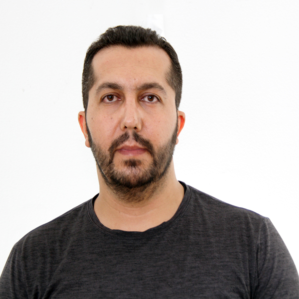
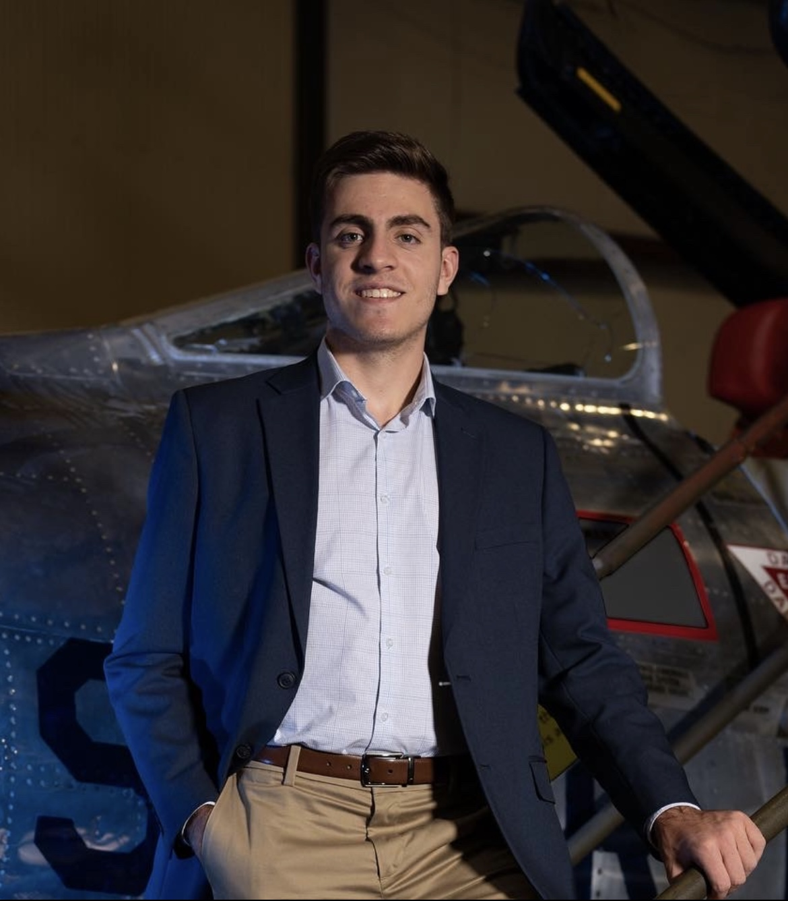
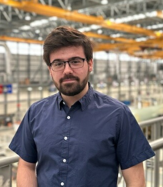
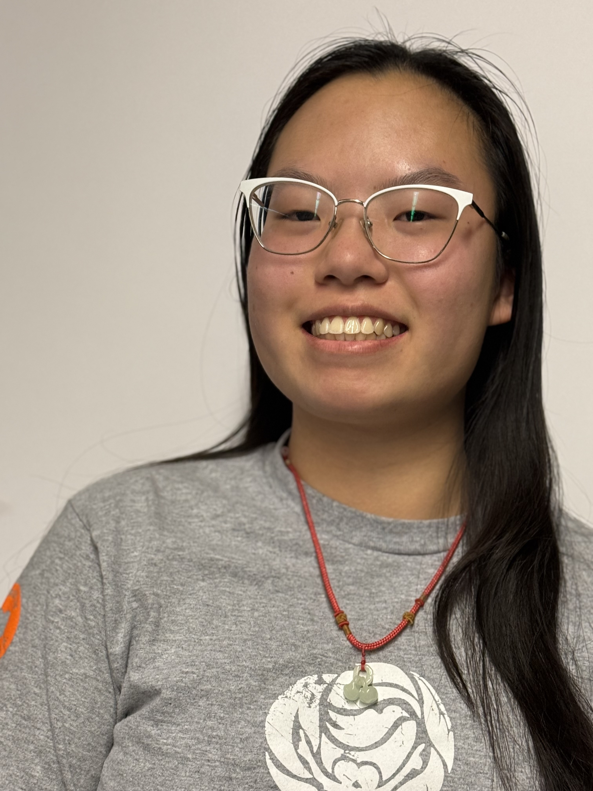
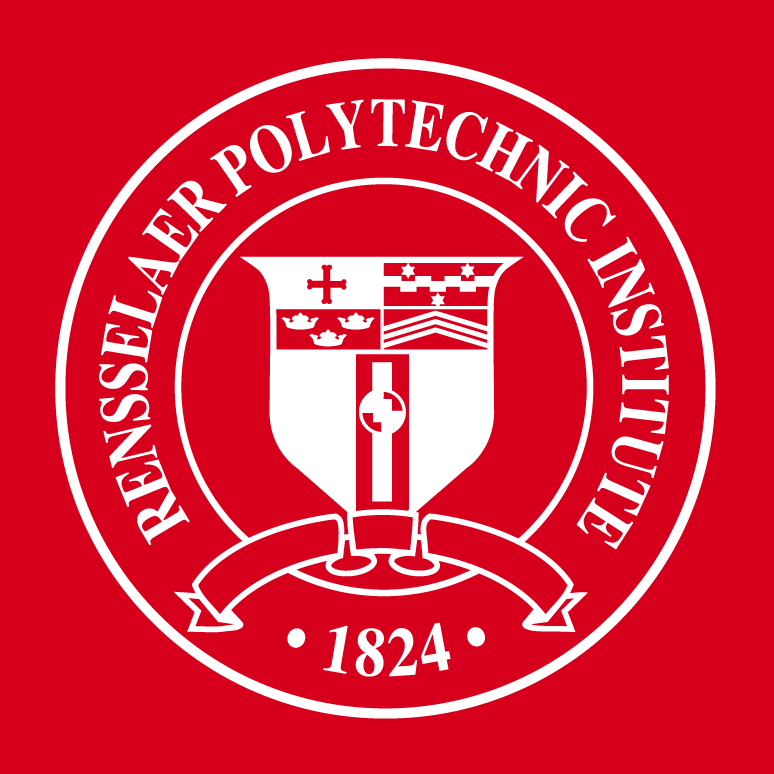

```{=html}
<link href="../html/pages.css" rel="stylesheet">
<link href='https://unpkg.com/boxicons@2.1.4/css/boxicons.min.css' rel='stylesheet'>
<link href="https://unpkg.com/boxicons@2.1.2/css/boxicons.min.css" rel="stylesheet">
```


```{=html}
Our team is driven by a shared passion for excellence and collaboration. Together, we use our diverse skills and experiences to come up with innovative solutions and achieve great things. We believe that working as a team is key to our success, helping us tackle challenges and reach higher goals. Our motivation is inspired by Henry Ford's wisdom:
<br>
"Coming together is a beginning, staying together is progress, and working together is success."


<body>


    <div class="container">
        <div id="scrolling-text" class="hidden">
          Text that appears as you scroll down...
        </div>
        <!-- Add your content here -->
        <div class="content">
          <!-- Your main content goes here -->
          <!-- You can add a long content to enable scrolling -->
          <h2><u>Principal Investigator</u></h2>
          <br> </br>
  

          <div style="display: flex; align-items: center;">
            
            <div style="text-align: left; margin-left: 20px;">
                <span style="font-size: 20px;"><b>Ozgur Tumuklu</b>, Ph.D.</span>
                <br>
                Asst. Professor
                <br>
                Department of Mechanical, Aerospace, and Nuclear Engineering (MANE)
                <br>
                Rensselaer Polytechnic Institute (RPI)
                <br>
                Erik Jonsson Engineering Center, Troy, NY 12180
                <br>
                <div class="home-sci">
                    <a href="Resumes/CV_Tumuklu.pdf"><i class='bx bx-id-card'></i></a>
                    <a href="https://x.com/HAVAlabrpi"><i class='bx bxl-twitter'></i></a>
                    <a href="https://www.linkedin.com/in/ozgur-tumuklu-37811919/"><i class='bx bxl-linkedin'></i></a>
                    <a href="mailto:tumuko@rpi.edu"><i class='bx bx-mail-send'></i></a> 
                    <a href="mailto:ozgurtumuklu@gmail.com"><i class='bx bxl-gmail' ></i></a> 
                </div>
            </div>
        </div>
        <br>
        <br>
        <h2> <u> Graduate Researchers</u></h2>
        <br> </br>

        <br> <div style="display: flex; align-items: center;">
            
            <div style="text-align: left; margin-left: 20px;">
                <span style="font-size: 20px;"><b>Meliksah Koca</b></span>
                <br>
                Ph.D. Student
                <br>
                Department of Mechanical, Aerospace, and Nuclear Engineering (MANE)
                <br>
                Rensselaer Polytechnic Institute (RPI)
                <br>
                Erik Jonsson Engineering Center, Troy, NY 12180
                <br>
                <div class="home-sci">
                    <a href="mailto:kocam@rpi.edu"><i class='bx bx-mail-send'></i></a>
                    <a href="mailto:"><i class='bx bxl-gmail' ></i></a>
                </div>
            </div>
        </div>
        <br>
        <br>


        <br> <div style="display: flex; align-items: center;">
            
            <div style="text-align: left; margin-left: 20px;">
                <span style="font-size: 20px;"><b>Charles Carrillo</b></span>
                <br>
                Ph.D. Student
                <br>
                Department of Mechanical, Aerospace, and Nuclear Engineering (MANE)
                <br>
                Rensselaer Polytechnic Institute (RPI)
                <br>
                Erik Jonsson Engineering Center, Troy, NY 12180
                <br>
                <div class="home-sci">
                    <a href="https://www.linkedin.com/in/charles-carrillo-d95/"><i class='bx bxl-linkedin'></i></a>
                    <a href="mailto:carric3@rpi.edu"><i class='bx bx-mail-send'></i></a>
                </div>
            </div>
        </div>
        <br>
        <br>


        <div style="display: flex; align-items: center;">
            
            <div style="text-align: left; margin-left: 20px;">
                <span style="font-size: 20px;"><b> Mateo Gutierrez </b></span>
                <br>
                M.S. Student (Co-term) 
                <br>
                Department of Mechanical, Aerospace, and Nuclear Engineering (MANE)
                <br>
                Rensselaer Polytechnic Institute (RPI)
                <br>
                Erik Jonsson Engineering Center, Troy, NY 12180
                <br>
                <div class="home-sci">
                    <a href="mailto:gutiel2@rpi.edu"><i class='bx bx-mail-send'></i></a> 
                </div>
            </div>
        </div>
        <br>
        <br>

         <div style="display: flex; align-items: center;">
            
            <div style="text-align: left; margin-left: 20px;">
                <span style="font-size: 20px;"><b> Michael Lauver </b></span>
                <br>
                M.Eng. Student
                <br>
                Department of Mechanical, Aerospace, and Nuclear Engineering (MANE)
                <br>
                Rensselaer Polytechnic Institute (RPI)
                <br>
                Erik Jonsson Engineering Center, Troy, NY 12180
                <br>
                <div class="home-sci">
                    <a href="mailto:lauvem@rpi.edu"><i class='bx bx-mail-send'></i></a> 
                </div>
            </div>
        </div>
        <br>
        <br>

         <div style="display: flex; align-items: center;">
            
            <div style="text-align: left; margin-left: 20px;">
                <span style="font-size: 20px;"><b> Ryan Ing </b></span>
                <br>
                M.S. Student (Co-term)
                <br>
                Department of Mechanical, Aerospace, and Nuclear Engineering (MANE)
                <br>
                Rensselaer Polytechnic Institute (RPI)
                <br>
                Erik Jonsson Engineering Center, Troy, NY 12180
                <br>
                <div class="home-sci">
                    <a href="https://www.linkedin.com/in/ryan-ing1/"><i class='bx bxl-linkedin'></i></a>
                    <a href="mailto:ingr@rpi.edu"><i class='bx bx-mail-send'></i></a> 
                </div>
            </div>
        </div>
        <br>
        <br>

         <div style="display: flex; align-items: center;">
            
            <div style="text-align: left; margin-left: 20px;">
                <span style="font-size: 20px;"><b> Jolie Dolan </b></span>
                <br>
                M.Eng. Student (Co-term)
                <br>
                Department of Mechanical, Aerospace, and Nuclear Engineering (MANE)
                <br>
                Rensselaer Polytechnic Institute (RPI)
                <br>
                Erik Jonsson Engineering Center, Troy, NY 12180
                <br>
                <div class="home-sci">
                    <a href="https://www.linkedin.com/in/jolie-dolan-775209221/"><i class='bx bxl-linkedin'></i></a>
                    <a href="mailto:dolanj2@rpi.edu"><i class='bx bx-mail-send'></i></a> 
                </div>
            </div>
        </div>
        <br>
        <br>


        <h2><u> Undergraduate Researchers </u></h2>
        <br> </br>
        <div style="display: flex; align-items: center;">
            
            <div style="text-align: left; margin-left: 20px;">
                <span style="font-size: 20px;"><b>Joseph D. Franciamore </b></span>
                <br>
                Undergraduate Hypersonics and Plasma Dynamics Researcher 
                <br>
                Department of Mechanical, Aerospace, and Nuclear Engineering (MANE)
                <br>
                Rensselaer Polytechnic Institute (RPI)
                <br>
                 George M. Low Center for Industrial Innovation, Troy, NY 12180 
                <br>
                <div class="home-sci">
                    <a href="https://www.linkedin.com/in/joseph-franciamore-0556b3293/"><i class='bx bxl-linkedin'></i></a>
                    <a href="mailto:francj4@rpi.edu"><i class='bx bx-mail-send'></i></a> 
                    <a href="mailto:jfranciamore12@gmail.com "><i class='bx bxl-gmail' ></i></a> 
                </div>
            </div>
        </div>
        <br>
        <br>
        <div style="display: flex; align-items: center;">
            
            <div style="text-align: left; margin-left: 20px;">
                <span style="font-size: 20px;"><b>Casey Duncan </b></span>
                <br>
                Undergraduate  Researcher 
                <br>
                Department of Mechanical, Aerospace, and Nuclear Engineering (MANE)
                <br>
                Rensselaer Polytechnic Institute (RPI)
                <br>
                Erik Jonsson Engineering Center, Troy, NY 12180

                <br>
                <div class="home-sci">
                    <a href="https://www.linkedin.com/in/casey-duncan-0456962b7/"><i class='bx bxl-linkedin'></i></a>
                    <a href="mailto:duncac5@rpi.edu"><i class='bx bx-mail-send'></i></a> 
                </div>
            </div>
        </div>
        <br>
        <br>
        <div style="display: flex; align-items: center;">
            
            <div style="text-align: left; margin-left: 20px;">
                <span style="font-size: 20px;"><b>Johnny Aiello </b></span>
                <br>
                Undergraduate  Researcher 
                <br>
                Department of Mechanical, Aerospace, and Nuclear Engineering (MANE)
                <br>
                Rensselaer Polytechnic Institute (RPI)
                <br>
                Erik Jonsson Engineering Center, Troy, NY 12180

                <br>
                <div class="home-sci">
                    <a href="mailto:aiellj@rpi.edu"><i class='bx bx-mail-send'></i></a> 
                </div>
            </div>
        </div>
        <br>
        <br>

         <div style="display: flex; align-items: center;">
            
            <div style="text-align: left; margin-left: 20px;">
                <span style="font-size: 20px;"><b>Rowen Costich </b></span>
                <br>
                Undergraduate  Researcher 
                <br>
                Department of Mechanical, Aerospace, and Nuclear Engineering (MANE)
                <br>
                Rensselaer Polytechnic Institute (RPI)
                <br>
                Erik Jonsson Engineering Center, Troy, NY 12180

                <br>
                <div class="home-sci">
                    <a href="mailto:costir@rpi.edu"><i class='bx bx-mail-send'></i></a> 
                </div>
            </div>
        </div>
        <br>
        <br>

            <div style="display: flex; align-items: center;">
            
            <div style="text-align: left; margin-left: 20px;">
                <span style="font-size: 20px;"><b>Benjamin Chaput </b></span>
                <br>
                Undergraduate  Researcher 
                <br>
                Department of Mechanical, Aerospace, and Nuclear Engineering (MANE)
                <br>
                Rensselaer Polytechnic Institute (RPI)
                <br>
                Erik Jonsson Engineering Center, Troy, NY 12180

                <br>
                <div class="home-sci">
                    <a href="https://www.linkedin.com/in/benchaput/"><i class='bx bxl-linkedin'></i></a>
                    <a href="mailto:chapub@rpi.edu"><i class='bx bx-mail-send'></i></a> 
                </div>
            </div>
        </div>
        <br>
        <br>
            <div style="display: flex; align-items: center;">
            
            <div style="text-align: left; margin-left: 20px;">
                <span style="font-size: 20px;"><b>Joy Xiao</b></span>
                <br>
                Undergraduate  Researcher 
                <br>
                Department of Mechanical, Aerospace, and Nuclear Engineering (MANE)
                <br>
                Rensselaer Polytechnic Institute (RPI)
                <br>
                Erik Jonsson Engineering Center, Troy, NY 12180

                <br>
                <div class="home-sci">
                    <a href="https://www.linkedin.com/in/joy-xiao-898388336/"><i class='bx bxl-linkedin'></i></a>
                    <a href="mailto:xiaoy13@rpi.edu"><i class='bx bx-mail-send'></i></a> 
                </div>
            </div>
        </div>
        <br>
        <br>
            <div style="display: flex; align-items: center;">
            
            <div style="text-align: left; margin-left: 20px;">
                <span style="font-size: 20px;"><b> Marie Borca-Tasciuc</b></span>
                <br>
                Undergraduate  Researcher 
                <br>
                Department of Mechanical, Aerospace, and Nuclear Engineering (MANE)
                <br>
                Rensselaer Polytechnic Institute (RPI)
                <br>
                Erik Jonsson Engineering Center, Troy, NY 12180

                <br>
                <div class="home-sci">
                    <a href="https://www.linkedin.com/in/marie-borca-tasciuc-2b88922b2/"><i class='bx bxl-linkedin'></i></a>
                    <a href="mailto:borcat@rpi.edu"><i class='bx bx-mail-send'></i></a> 
                </div>
            </div>
        </div>
        <br>
        <br>


        <h2> <u> Alumni</u></h2>
        <br> </br>

        <div style="display: flex; align-items: center;">
            
            <div style="text-align: left; margin-left: 20px;">
                <span style="font-size: 20px;"><b>Tyler Martinus</b></span>
                <br>
                M.S. (2025)
                <div class="home-sci">
                    <a href="https://www.linkedin.com/in/tyler-martinus/"><i class='bx bxl-linkedin'></i></a>
                    <a href="mailto:martit6@rpi.edu"><i class='bx bx-mail-send'></i></a> 
                </div>
            </div>
        </div>
        <br>
        <br>
        <div style="display: flex; align-items: center;">
            
            <div style="text-align: left; margin-left: 20px;">
                <span style="font-size: 20px;"><b>Nick Longchamp</b></span>
                <br>
                M.Eng. (2024)
                <div class="home-sci">
                    <a href="mailto:longcn@rpi.edu"><i class='bx bx-mail-send'></i></a> 
                </div>
            </div>
        </div>
        <br>
        <br>

        </div>
      </div>
```
